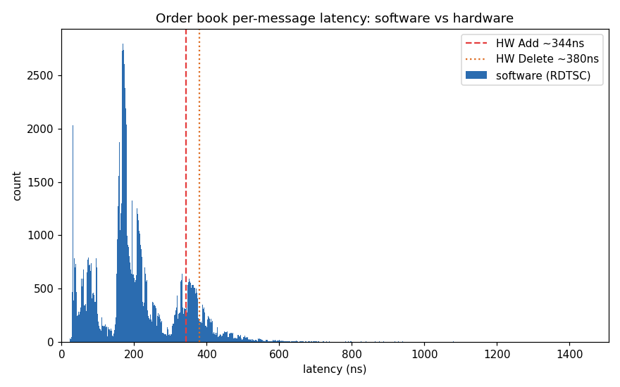
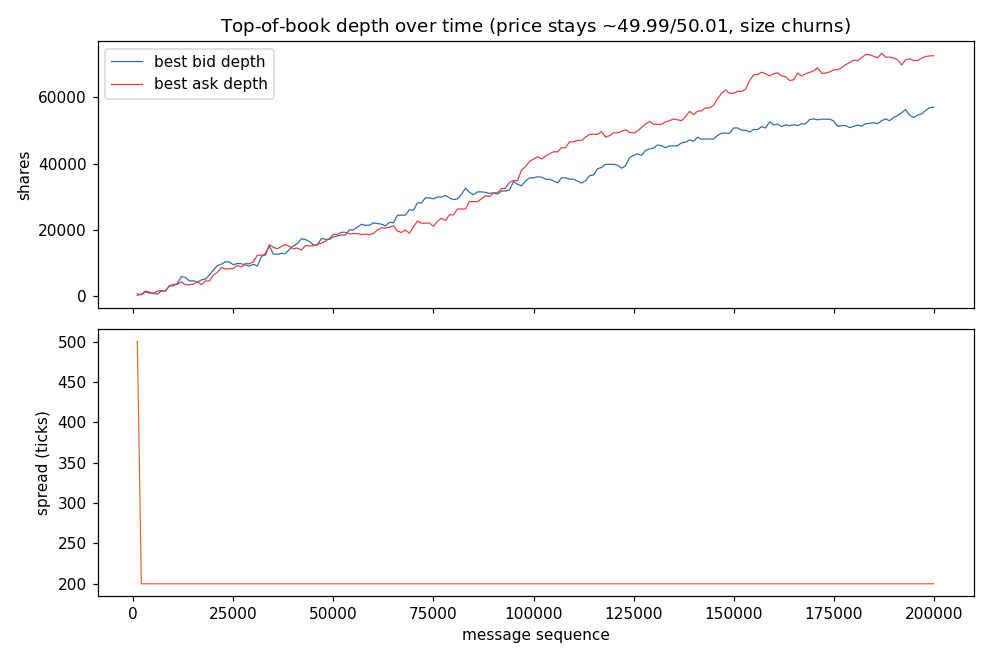

# ITCH order book, same feed, C++ and RTL

A NASDAQ ITCH 5.0 limit order book built twice: once as SIMD-tuned C++ chasing
sub-microsecond software latency, and once as synthesizable SystemVerilog doing
deterministic nanoseconds. Both consume the same byte stream and must produce
bit-identical book state, the RTL is diffed against a reference model on every
message. The point is to measure the software/hardware latency gap instead of
just quoting it.

## Contents

- [Quick start](#quick-start)
- [Results](#results)
- [What's inside](#whats-inside)
- [GUI](#gui)
- [Layout](#layout)
- [Limitations](#limitations)
- [AI Use and Tooling](#ai-use-and-tooling)

## Quick start

```bash
bash run_all.sh            # build + all tests + benchmark + analysis
SKIP_RTL=1 bash run_all.sh # software only
make test                  # software suite
make sim                   # RTL Verilator tests
make bench                 # std::map book vs direct-indexed+SIMD book
```

No market data download needed. `make data` generates a byte-exact synthetic
ITCH stream that feeds both pipelines. Windows/MSYS2 users: read
[docs/BUILDING.md](docs/BUILDING.md) first (PATH-ordering trap).

## Results

Software, per message (parse + book update, RDTSC, AVX2 on this machine):

| | p50 | p99 | p99.9 |
|---|---|---|---|
| all messages | ~190 ns | ~540 ns | ~1.3 µs |
| Trade `P` (no book op) | ~35 ns | ~90 ns | |
| Replace `U` (worst type) | ~260 ns | ~650 ns | |

Hardware, replaying the same 20k-message stream at the modeled 250 MHz:

| | before (byte-serial) | after (16 B/cycle + overlap) |
|---|---|---|
| service time p50 (1/throughput) | 200 ns (50 cyc) | **60 ns (15 cyc)** |
| service time p99 | 248 ns | 84 ns |
| throughput | ~5.0 M msg/s | **~20.9 M msg/s (4.2×)** |
| total cycles, 20k messages | 1,006,092 | 239,458 |

The front end originally streamed one byte per cycle, so a 38-byte Add spent
~40 of its ~50 cycles just shifting bytes in. Two changes closed that: the
ingest bus is now 16 bytes per cycle (a compacting-window framer handles
messages starting and ending at any byte offset within a word), and ingest is
decoupled from the book engine, so message N+1 streams in and is fully
assembled while N is still being applied. Steady-state throughput is now
engine-bound — a pure-Add stream commits every 8 cycles — and an Add arriving
at an idle book commits ~60 ns after its first byte, which now beats
software's ~190 ns p50 even at the conservative 250 MHz clock.

The determinism story is unchanged and still the real point: software's worst
case is ~7× its own median (cache misses, OS jitter) while hardware's p99.9
service time equals its p99 (84 ns), every time, including during the bursts
and volatility spikes when everyone else's software also slows down. The only
hardware tail left is the occasional best-price scan after a level empties,
which is bounded and visible in the perf counters rather than being a
scheduler surprise.



The direct-indexed + SIMD book is about **2×** faster than the `std::map`
version on the same stream (~90–110 vs ~200–235 ns/msg book-only at 1M
messages; run-to-run it lands anywhere from 1.5× to 2.6×. `make bench`).

The synthetic feed's reference mid-price doesn't drift, so best bid/ask stay
pinned near $49.99/$50.01 for the whole session; what actually moves is
resting size at the top of book, which grows steadily as the generator adds
far more liquidity than it consumes:



## What's inside

**Software** (`sw/`): file-replay / raw-socket / AF_XDP receivers (the kernel
ones Linux-guarded), a lock-free SPSC ring, an ITCH parser with a SIMD header
scan, an open-addressing order-ref table (structure-of-arrays, Wang hash,
SIMD probe, backward-shift deletion), a direct price-indexed book with a
vectorized best-price rescan, and a stats engine (VWAP, spread, top-5 imbalance,
depth). Every SIMD routine has AVX-512 / AVX2 / scalar paths chosen at compile
time; the scalar path is the test oracle.

**Hardware** (`rtl/`): `udp_stripper → itch_framer → itch_decoder →
order_ref_table → book_update_engine (+ best_tracker) → stats_engine`, 16
bytes per clock, SRAM-backed. The framer reassembles unaligned back-to-back
messages out of the word stream with a 32-byte compacting window, and ingest
of the next message overlaps the book update of the current one. The message
layouts in `ob_pkg.sv` mirror `itch_messages.hpp` exactly, so both sides
decode identical bytes to identical fields.

**Verification**: the software suite is ~140k assertions including a 200k-op
differential test of the hash table against `std::unordered_map` and a
bit-for-bit diff of the fast book against a `std::map` reference. The RTL suite
replays 20k+ messages through the Verilated pipeline and diffs full book state
against the reference model.

Building the RTL against that diff surfaced two genuine hardware bugs: a
linear-probe delete that orphaned collision chains (fixed with tombstones) and a
one-cycle handshake race in the best-price tracker that could commit a stale
best. Both write-ups are in [docs/DESIGN.md](docs/DESIGN.md); they're the most
instructive part of the project.

## GUI

There's also a small Streamlit dashboard for poking at it interactively:

```bash
pip install -r gui/requirements.txt
streamlit run gui/app.py
```

Three tabs: pick/generate a data source, replay it and watch the book (depth
ladder, spread), then run the same feed through all three engines (`std::map` /
SIMD / RTL) and compare latency distributions. It shells out to the same
binaries the command line uses, so the numbers match `run_all.sh`.

## Trading engine

The book replicator answers "what does the market look like"; the trading
engine answers "what would my strategy actually have earned in it". Strategies
are written in [backtest_project](../backtest_project)'s DSL, compiled offline
to flat bytecode (`python -m dsl.export strat.dsl strat.obp`), and executed by
a C++ VM that is golden-tested against the Python reference engine bar by bar.
Trade prints from the replayed ITCH stream build OHLCV bars; each completed
bar steps the strategy; signals become real limit orders with **queue-aware
fills**: an order joining a level tracks the displayed shares ahead of it
(watermarked by order-ref monotonicity), drains as executes/cancels consume
the queue, and fills only when flow actually reaches its position — plus
marketable sweeps across levels, price-through fills, partial fills, and
per-fill fees. Synthetic orders live in a shadow overlay; the replicated book
and the RTL equivalence stream are untouched.

```bash
make trade
build/orderbook_trade --gen 500000 --strategy data/strategies/sma_cross.obp \
    --bar-secs 5 --entry join --csv out/
python tools/compare_backtest.py out/bars.csv data/strategies/sma_cross.dsl out/
```

The comparison is the point: the same strategy on the same bars, analytic
next-open fills vs queued execution. On the synthetic stream above, joining
the touch *beats* the backtester's fixed-slippage assumption (maker fills earn
the spread) while `--entry cross` pays it back — the execution-model spread
between the two is exactly what a bar-close backtest cannot see. Fill
semantics are specified in `sw/trade/fill_engine.hpp` and enforced by the
`[fill_engine]`/`[order_manager]`/`[trade_e2e]` test suites; the VM parity
goldens are regenerated by `tools/gen_vm_golden.py` (which cross-checks its
instrumented run against `dsl.refengine.run` exactly before writing anything).

## Deeper documentation

Beyond [DESIGN.md](docs/DESIGN.md): a full technical study doc
([docs/TECH_DEEP_DIVE.md](docs/TECH_DEEP_DIVE.md) — data structures, framer,
overlap, both bug post-mortems, all measured numbers) and the current state +
roadmap ([docs/STATE_AND_ROADMAP.md](docs/STATE_AND_ROADMAP.md)).

## Layout

```
sw/        receiver/ parser/ book/ stats/ util/ trade/ tests/ + main.cpp
rtl/       *.sv, the streaming pipeline (incl. MoldUDP64 decap)
sim/       Verilator harness, reference model, RTL tests, board-chain test
fpga/      synth_urbana.tcl (OOC synth + reports), board/ (UART bridge,
           board top, XDCs, bitstream flow — see fpga/board/README.md)
tools/     gen_itch.cpp (synthetic feed), mold_wrap.cpp, bench.cpp,
           ob_host.py (board client), run_real_data.sh,
           gen_vm_golden.py + compare_backtest.py (trading engine)
data/      strategies/ (*.dsl, compiled *.obp, VM parity goldens),
           real_sample_scaled.itch (real NASDAQ excerpt, see data/README.md)
gui/       Streamlit dashboard + real-ITCH converter (gui/data/nasdaq_itch.py)
analysis/  latency/profile/depth plots
docs/      DESIGN.md, BUILDING.md, images
```

## FPGA status

The RTL synthesizes for real hardware: under `SYNTHESIS` the book becomes a
**price-banded** 1024-level window (base auto-centers on the first Add;
out-of-window events are dropped whole and counted — never partially
applied), the order-ref table shrinks to 1024 slots, and the whole design
**meets timing at 100 MHz on a Spartan-7 xc7s50** (OOC synthesis: WNS
+0.27 ns, ~12.6K LUTs / 38%, 4.5 BRAM, 4 DSP — reports in `fpga/reports/`).
The banded configuration is itself simulated (`test_banding`, plus the full
board chain in `make sim-board`), and `fpga/board/` carries a UART host link,
Urbana + Arty A7 pin constraints, and a full place-and-route bitstream flow
(`make bitstream BOARD=urbana`). See `fpga/board/README.md` for the link
protocol and bring-up ladder.

## Limitations

Single-symbol RTL (software is multi-symbol; real-data replay filters one
symbol host-side); the FPGA build's 1024-tick band needs host-side tick
rescaling for real symbols (`data/README.md`) — a production build would
widen the window (BRAM remap + re-centering); MoldUDP64 gap handling is
detection-only (no retransmit request path); 8-byte timestamps per the
internal format (real ITCH uses 6 — normalized by the converter, kept
deliberately: the framer's minimum-frame invariant depends on it).

Trading engine: no market impact (synthetic fills don't deplete displayed
liquidity), hidden/odd-lot Trade ('P') prints don't drain displayed queues,
and queue watermarking assumes monotonic order refs (true for the generator
and standard for real ITCH). Software-only — strategy order flow does not
enter the RTL pipeline.

## AI Use and Tooling

AI-assisted tools were used for implementation support, debugging, and
documentation. I reviewed and modified the resulting RTL and C++ code and
validated the design with software tests, RTL simulation, and differential
checking. Build details and development notes are in [TOOLING.md](TOOLING.md).
